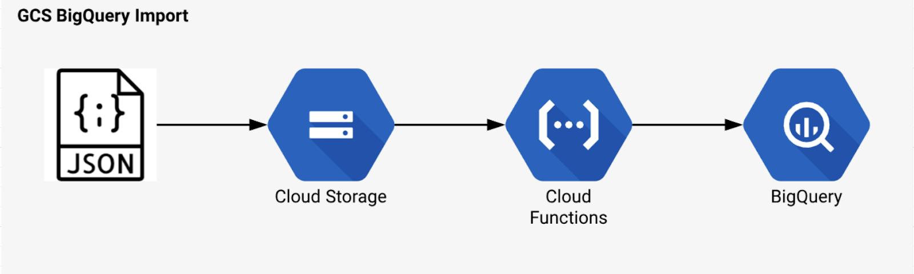

# PrimeiroProjeto - GCP e AWS

>Resolução de problemas de negócio simulados e soluções de requisições utilizando Google BigQuery, Google Storage e BD Relacional.
Posteriormente seguindo o versionamento do curso utilizando Datawarehouse Northwind, AWS Redshift e AWS S3.

## Objetivo: 

O presente projeto tem como objetivo simular requisições e problemas de negócios de uma empresa fictícia com um banco de dados (organização fictícia que gerencia pedidos, produtos, clientes, fornecedores, colaboradores, etc). 

O esquema do BD Relacional da empresa se dá de acordo com a imagem:

## Preparação do ambiente

> No meu caso preferi ultilizar o BigQuery no primeiro momento, que não ofereceria custos extras,
> ultilizei da seguinte estrutura:
> 
> P.s.: Na carga das tabelas, os nomes das colunas perderam o underline '_'
 
* Upload dos arquivos no Google Cloud Storage, mas podendo ser upado diretamente dentro no BigQuery;
* Criação do Dataset dentro do Google BigQuery;
* Copia das tabelas do Cloud Storage para o dataset, ultilizando 'detectar automaticamente Esquemas', nas opções avançadas mudar o delimiter para ';' e marcar 'ignorar a primeira linha';
* Após a carga de todas as tabelas estamos prontos para resolução de problemas;
 

Para realizar as atividades propostas com AWS, utilizou-se da seguinte estrutura:
 
* Criação de Cluster Redshift;
* Criação da estrutura do Datawarehouse Northwind;
* Upload dos arquivos .csv do PC Local para um bucket no AWS S3;
* Cópia dos dados do AWS S3 para o datawarehouse no Redshift;
* Resolução das atividades que simulam problemas de negócios e exportação de csv.
 
 
 
 
 ## Atividades: 
 1. Gerar um relatório com os valores tabelados dos produtos e com os valores realmente executados nas vendas, exibindo a diferença entre esses valores e exibir a quantidade de produtos vendidos por venda.    

 2. Agrupar o valor das vendas dos vendedores no ano de 2022 para analisar o desempenho do vendedor "Robert King".

 3. Selecionar os 10 produtos que têm os preços tabelados mais caros.

4. Mostrar a quantidade de vendas total por fornecedor nos anos de 2021 e 2020 e a diferença entre o total de vendas desses anos.

5. Selecionar as 5 categorias que mais venderam em cada ano.

## Arquivos de resolução

Os arquivos de resolução se encontram anexados e separados por atividade. Consistem em scripts SQL e arquivos gerados no formato .csv
_______
## Meta

Link do curso: <https://www.udemy.com/course/engenheiro-de-dados/>

Arthur Amaral de Lima --- [Linkedin](https://www.linkedin.com/in/arthuramaral-py/) --- arthur.absens@gmail.com
